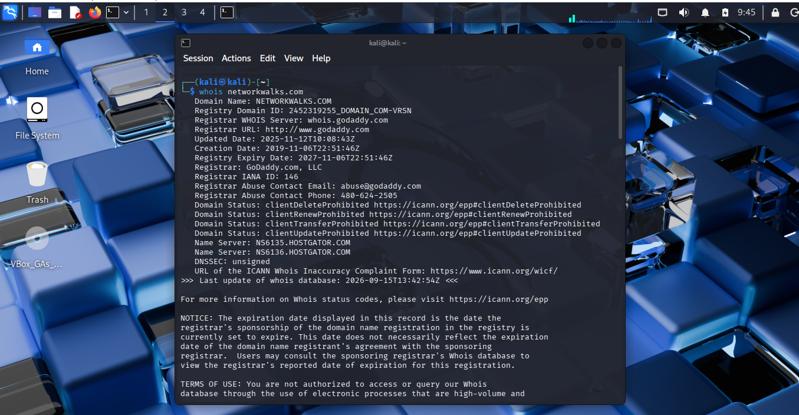

# Task 1 — WHOIS

## Requirement

Query the public domain registration record to find registration details, dates and name servers.

## Command

```bash
whois networkwalks.com
```

## Evidence



Full command output: [`output.txt`](output.txt)
