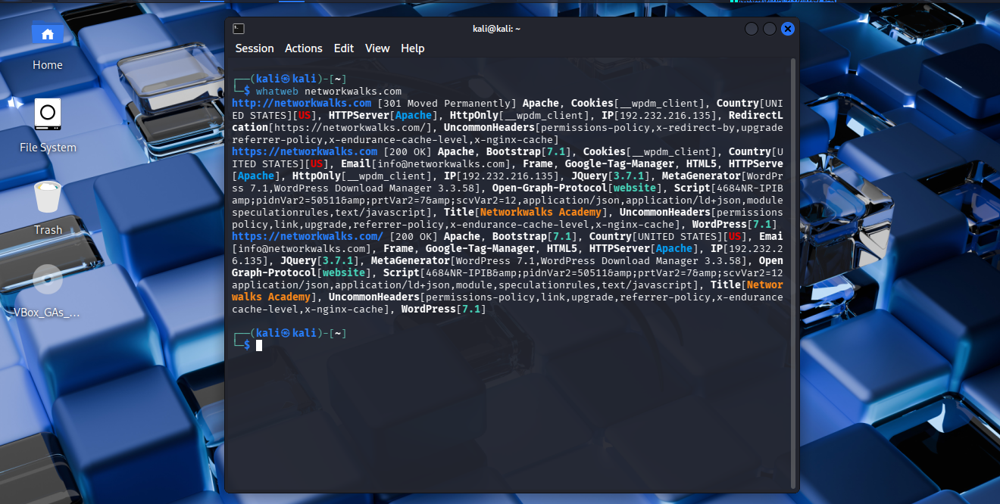

# Task 2 — WhatWeb

## Requirement

Fingerprint the technologies running on the target website.

## Command

```bash
whatweb networkwalks.com
```

## Evidence



Full command output: [`output.txt`](output.txt)
