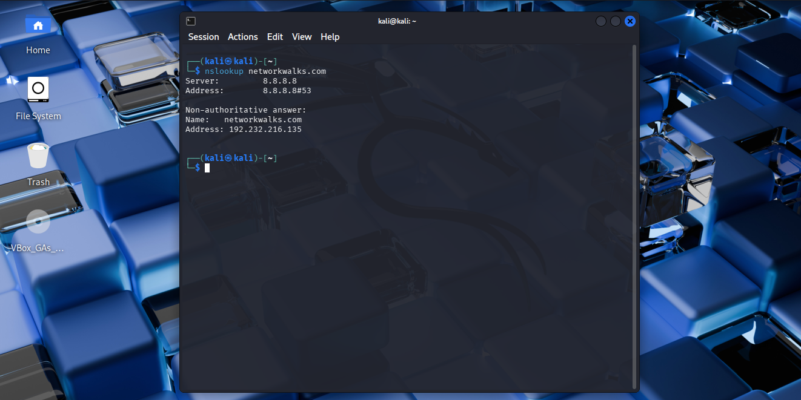

# Task 3 — NSLookup

## Requirement

Resolve the domain name to its IP address using DNS.

## Command

```bash
nslookup networkwalks.com
```

## Evidence



Full command output: [`output.txt`](output.txt)
