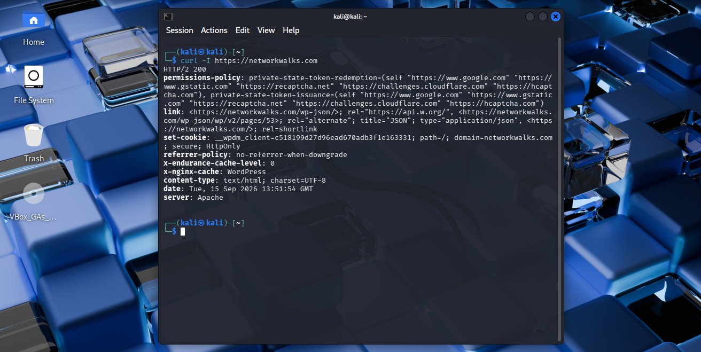

# Task 4 — cURL

## Requirement

Inspect the HTTP response headers returned by the target.

## Command

```bash
curl -I https://networkwalks.com
```

## Evidence



Full command output: [`output.txt`](output.txt)
