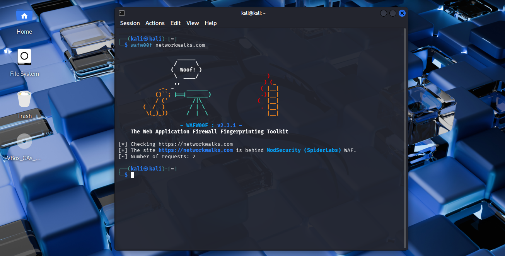

# Task 5 — Wafw00f

## Requirement

Detect whether a Web Application Firewall (WAF) is protecting the target site.

## Command

```bash
wafw00f networkwalks.com
```

## Evidence



Full command output: [`output.txt`](output.txt)
