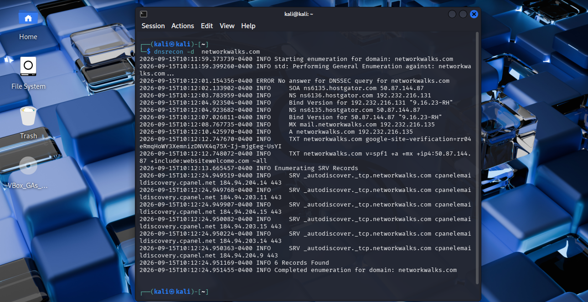

# Task 6 — DNSRecon

## Requirement

Enumerate DNS records including name servers, mail servers, SPF, TXT and SRV records.

## Command

```bash
dnsrecon -d networkwalks.com
```

## Evidence



Full command output: [`output.txt`](output.txt)
